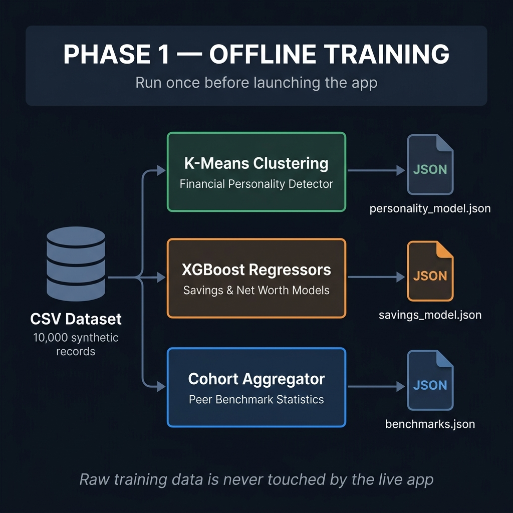
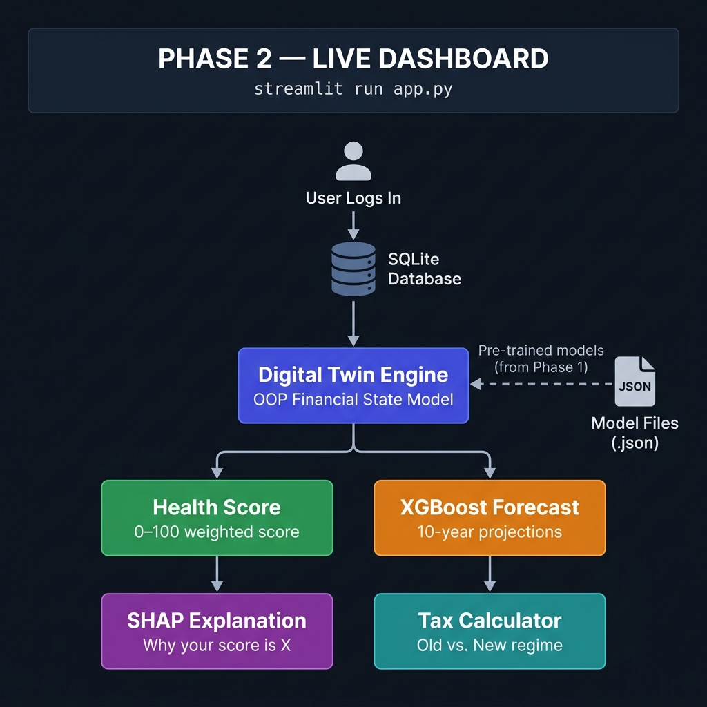

<div align="center">


<br/>

# Financial Digital Twin *(In Progress)*

[](https://python.org)
[](https://streamlit.io)
[](https://xgboost.readthedocs.io)
[](https://shap.readthedocs.io)
[](https://sqlite.org)
[](#)

> 🧠 **FinTwin AI** simulates your complete financial life — scoring health, forecasting wealth, optimizing taxes,
> and coaching behavior — all built specifically for **Indian salaried professionals aged 22–40**.

</div>

---


## ⚙️ How It Works

The app operates in **two clearly separated phases**:

<div align="center">

### 🔁 Phase 1 — Offline Training *(Run Once)*


### 🚀 Phase 2 — Live Dashboard


</div>

> 💡 Raw training data is **never accessed** by the live app. Only the pre-trained JSON model files are loaded at runtime.

---

## 📋 Dashboard Modules

<div align="center">

| | Module | Description |
|:---:|:---|:---|
| 👤 | **Digital Twin** | Build your financial profile — income, assets, debts, goals |
| 📊 | **Financial Health** | Get a 0–100 health score with SHAP-powered explanations |
| 🔮 | **Forecast & Simulation** | Run 10-year what-if projections with XGBoost models |
| 💸 | **Spending Behavior** | Compare spending patterns against occupation peers |
| 🏦 | **Tax Intelligence** | Find your optimal Old vs. New tax regime instantly |
| 🎯 | **Goal Planner** | Track milestones for home, education, or retirement goals |
| 💬 | **AI Behavioral Coach** | Get advice tailored to your financial personality type |

</div>

---

## 🧮 Financial Health Score

<div align="center">

Your overall score **(0–100)** is a weighted blend of six financial metrics:

| Metric | 🎯 Benchmark | ⚖️ Weight |
|:---|:---:|:---:|
| 💰 Savings Rate | ≥ 30% of income | **25%** |
| 📉 EMI Burden | ≤ 35% of income | **20%** |
| 🛡️ Emergency Fund | ≥ 6 months of expenses | **20%** |
| 📈 SIP Investment | ≥ 15% of income | **15%** |
| 🏥 Insurance Coverage | Life ≥ 120× salary; Health ≥ ₹5L | **10%** |
| 🏦 Debt-to-Income | Total debt ≤ 1.5× annual income | **10%** |

**Grade Scale:** &nbsp; 🟢 **A** (80–100) &nbsp;·&nbsp; 🔵 **B** (60–79) &nbsp;·&nbsp; 🟡 **C** (40–59) &nbsp;·&nbsp; 🔴 **D** (< 40)

</div>

---

## 🗂️ Project Structure

```
FinTwin_AI/
├── 📄 app.py                 # Streamlit entry point & dashboard landing page
├── ⚙️ config.py              # Tax slabs, economic constants, score weights
├── 📦 requirements.txt       # Python dependencies
│
├── 🎓 training/
│   └── train_offline.py      # ← Run this FIRST (trains all ML models)
│
├── 📊 data/
│   ├── generator.py          # Generates 10,000 synthetic Indian profiles
│   ├── preprocessor.py       # Feature engineering pipeline
│   └── models/               # Saved model artifact files (.json)
│
├── 🤖 models/
│   ├── twin_engine.py        # OOP Digital Twin + Health Score formulas
│   ├── predictor.py          # XGBoost savings & net worth forecaster
│   ├── clustering.py         # K-Means financial personality detector
│   └── explainability.py     # SHAP explainer computations
│
├── 🛠️ utils/
│   ├── tax_calculator.py     # Indian Tax Engine (Old vs. New regime)
│   ├── simulator.py          # What-if scenario simulation engine
│   ├── coach.py              # Personality-driven AI recommendations
│   └── visualizer.py         # Plotly chart template builders
│
├── 💾 database/
│   ├── schema.sql            # Table & constraint definitions
│   ├── db_manager.py         # CRUD operations (profiles, goals, ledger)
│   └── financial_twin.db     # SQLite database file
│
└── 📱 pages/
    ├── 01_Digital_Twin.py
    ├── 02_Financial_Health.py
    ├── 03_Behavior_Analysis.py
    ├── 04_Financial_Personality.py
    ├── 05_Forecasting.py
    ├── 06_Scenario_Simulator.py
    ├── 07_Tax_Intelligence.py
    ├── 08_AI_Coach.py
    ├── 09_Goal_Planner.py
    ├── 10_Explainable_AI.py
    └── 11_Settings.py
```

---

## 🚀 Getting Started

```bash
# 1. Clone & install dependencies
git clone https://github.com/your-username/FinTwin_AI.git
cd FinTwin_AI
pip install -r requirements.txt

# 2. Configure environment variables
# Copy template and add your GROQ_API_KEY (and optional SMTP credentials)
cp .env.example .env

# 3. Train models (pre-trained weights are already included in data/models/)
# Optional: run only if you generate new synthetic data
# python data/generator.py
# python training/train_offline.py

# 4. Launch the dashboard
streamlit run app.py
```

---

## 🔑 Demo Login

<div align="center">

Try it instantly with the pre-seeded demo account:

| 📧 Email | 🔒 Password |
|:---:|:---:|
| `demo@fintwin.app` | `Demo@123` |

</div>

---

## 📜 License

This project is licensed under the **MIT License** — see the [LICENSE](LICENSE) file for details.

Copyright © 2026 **Alok Rana**
