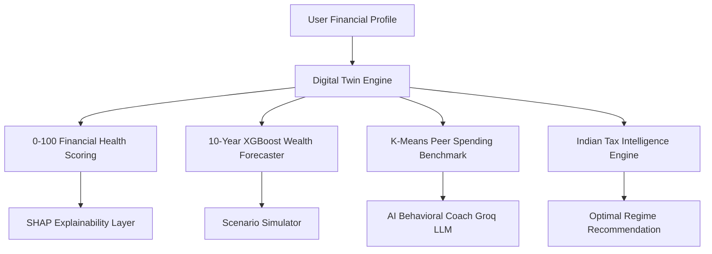

# Product Requirements Document (PRD)
## Project Name: FinTwin AI
### Document Version: 1.0.0 | Status: Approved for MVP 

---

## 1. Executive Summary & Product Description
**FinTwin AI** is an intelligent financial digital twin platform purpose-built for Indian salaried professionals aged 22–40. It creates a dynamic, simulated reflection of a user's financial ecosystem by combining gradient-boosted forecasting (XGBoost), unsupervised spending behavior segmentation (K-Means clustering), and explainable artificial intelligence (SHAP), coupled with an LLM-driven behavioral coach powered by the Groq API. 

Unlike traditional static spreadsheets or retrospective expense trackers that merely categorize past transactions, FinTwin AI answers forward-looking, high-impact financial questions:
- *"How financially resilient am I today?"*
- *"What will my net worth look like in 5 to 10 years if I take an auto loan or switch jobs?"*
- *"Between the Old and New tax regimes, which option saves me more money under the latest Union Budget?"*
- *"How do my discretionary spending habits compare against matched demographic peers?"*

---

## 2. Problem Statement
Salaried professionals in India face unprecedented challenges in managing personal finances despite rising incomes:
1. **Fragmented Financial Visibility:** Assets, mutual funds, EPF, loans, and credit cards are locked in disparate platforms, leaving users with no unified measure of net financial health.
2. **Tax Confusion Under Dual Regimes:** Annual tax filing under Section 115BAC versus the Old Regime requires complex manual calculations involving HRA, Section 80C, 80D, 24(b), and NPS deductions.
3. **Black-Box Financial Advice:** Traditional advisors or fintech algorithms offer opaque recommendations without explaining the underlying "why", resulting in user skepticism and abandonment.
4. **Lack of Predictive Simulation:** Individuals make major life commitments (e.g., home loans, career pivots, sabbaticals) without data-backed projections of long-term net worth impact.
5. **Behavioral Inaction:** Generic financial literacy tips fail because they ignore behavioral psychology and user-specific risk profiles.

---

## 3. Target Audience & Personas

### Demographics
- **Target Age Group:** 22 – 40 years old
- **Geography:** Tier 1 and Tier 2 cities across India (Bengaluru, Mumbai, Pune, NCR, Hyderabad, Chennai, etc.)
- **Income Range:** Salaried employees earning ₹4,00,000 to ₹35,00,000+ per annum
- **Tech Savviness:** Moderate to high (familiar with UPI, mobile banking, and web apps)

### User Personas

| Persona | Demographics | Pain Point | FinTwin AI Value Proposition |
|---|---|---|---|
| **Priya (The Early Career Techie)** | Age 24, Software Engineer, CTC ₹9 LPA | Struggles with high discretionary spending on dining/gadgets, zero systematic investments, and confusion over tax deductions. | Benchmarks spending against peers, calculates tax savings under New Regime, and establishes an automated SIP habit. |
| **Rahul (The Mid-Career Homebuyer)** | Age 32, Marketing Lead, CTC ₹18 LPA, Married with 1 child | Balancing a home loan EMI (₹45,000/mo) with child education goals; unsure if his emergency fund and insurance coverage are adequate. | Uses Scenario Simulator to test interest rate hikes, reviews Health Score to spot insurance gaps, and tracks goal timelines. |
| **Ananya (The Senior Professional)** | Age 38, Director of Product, CTC ₹38 LPA | High tax bracket, diversified investments, seeking to project wealth trajectory toward early financial independence (FIRE). | 10-year XGBoost wealth forecasting, SHAP driver analysis, and optimal tax optimization across Old vs. New regimes. |

---

## 4. Product Goals & Objectives

### Business & User Goals
- **G1 — Holistic Health Scoring:** Convert complex finances into a single, intelligible 0–100 benchmark grade (A, B, C, D) based on 6 core pillars.
- **G2 — Transparent Explainability:** Provide SHAP-backed, human-readable explanations so users understand exactly why their score rose or fell.
- **G3 — Actionable Tax Optimization:** Deliver instant Old vs. New tax regime recommendations tailored to the latest Indian tax slabs and deductions.
- **G4 — Predictive Decision Testing:** Enable 10-year what-if simulations of life events (job shifts, emergency shocks, real estate purchases).
- **G5 — Personalized AI Coaching:** Deliver contextual behavioral coaching aligned with the user’s detected spending personality.

---

## 5. Core Features & Architecture Overview

### Feature Breakdown
1. **Digital Twin Profile Builder:** Structured capture of gross salary, monthly expenses, existing EMIs, liquid savings, mutual fund SIPs, term life coverage, and health insurance.
2. **0–100 Financial Health Scoring Engine:** Multi-factor weighted composite model measuring:
   - Savings Rate (25% weight)
   - EMI Burden Ratio (20% weight)
   - Emergency Fund Adequacy (20% weight)
   - SIP Investment Consistency (15% weight)
   - Insurance Protection Depth (10% weight)
   - Debt-to-Income Ratio (10% weight)
3. **10-Year Wealth & Savings Forecaster:** Machine-learning regression predicting multi-year capital accumulation factoring in income increments, inflation, and compound returns.
4. **Scenario Simulator ("What-If" Sandbox):** Interactive parameter manipulation (salary increment percentage, new car EMI, inflation rate change, emergency medical shock).
5. **Peer Spending & Personality Clustering:** Unsupervised K-Means clustering assigning the user to one of 4 archetypes (Disciplined Accumulator, Over-Leveraged Spender, Conservative Stagnator, Lifestyle Inflator).
6. **Indian Tax Intelligence Engine:** Side-by-side computation of tax liability under Old vs. New Regimes (Section 80C, 80D, 24(b), 80CCD(1B), and standard deduction).
7. **Explainable AI (XAI) Module:** Waterfall and bar visual representations of top positive and negative score drivers calculated via SHAP.
8. **Goal Milestones Planner:** Target timeline, required monthly allocation, and feasibility status for major goals (Emergency, House Down Payment, Retirement, Vehicle, Child Education).
9. **AI Behavioral Coach:** Low-latency conversational advisory using Groq API (`llama-3-70b-versatile` / `llama3-8b-8192`) grounding responses in the user's twin profile.

---

## 6. MVP Scope vs. Out-of-Scope

### In-Scope for MVP
- User authentication (SQLite-backed credentials with salt/hash).
- Comprehensive Digital Twin profile onboarding and profile updates.
- 0–100 composite Financial Health Score with grade indicators (A/B/C/D) and benchmark comparisons.
- Pre-trained XGBoost 10-year net worth and savings trajectory forecasting.
- What-If Scenario Simulator with real-time UI sliders.
- K-Means peer cohort segmentation with spending category benchmark charts.
- Dual Tax Regime calculator with deduction inputs and net savings summary.
- SHAP explainability visualizations explaining top 3 positive and top 3 negative drivers.
- AI Financial Coach dialog interface powered by Groq API.
- Goal tracking module calculating required monthly investments.
- 11 dedicated, responsive Streamlit dashboard pages.

### Out-of-Scope for MVP (Post-MVP Roadmap)
- Direct bank statement parsing (PDF/CSV upload) or live SMS transaction scraping.
- RBI Account Aggregator (AA) network integration.
- Direct broker order execution (Zerodha Kite, Groww, Upstox API).
- Multi-currency / NRI taxation compliance.
- Mobile native apps (iOS / Android).

---

## 7. User Stories & Acceptance Criteria

### US-01: Profile Setup & Digital Twin Creation
- **As a** salaried user,  
  **I want to** enter my monthly salary, living expenses, investments, EMIs, and insurance policies,  
  **So that** FinTwin AI can generate a digital twin model of my financial life.
  - *Acceptance Criteria:*
    - Given valid positive numbers, the profile saves to SQLite within 200ms.
    - If expenses + EMIs exceed monthly income, a clear warning banner is displayed.
    - System calculates derived metrics (savings rate, net monthly cashflow) instantly.

### US-02: Health Score & SHAP Breakdown
- **As a** user,  
  **I want to** view my overall score and understand which habits drag it down,  
  **So that** I know exactly which action will improve my financial stability.
  - *Acceptance Criteria:*
    - Score is rendered on a 0–100 gauge with letter grade (A/B/C/D).
    - Top 3 positive contributors and top 3 negative drags are shown with humanized labels.
    - Each metric shows the current value versus the recommended Indian benchmark.

### US-03: Old vs. New Tax Regime Comparison
- **As an** Indian taxpayer,  
  **I want to** compare my net tax payable under both regimes factoring my eligible deductions,  
  **So that** I can declare the optimal regime to my employer's payroll.
  - *Acceptance Criteria:*
    - Computes rebate under Section 87A for both regimes.
    - Applies standard deduction (₹50,000 / ₹75,000 as per chosen tax year).
    - Highlights exact rupee savings and provides a distinct "Recommended Regime" tag.

### US-04: Life Event Scenario Simulation
- **As a** prospective homebuyer,  
  **I want to** simulate adding an ₹40,000 monthly home loan EMI,  
  **So that** I can observe its impact on my 10-year net worth and emergency runway.
  - *Acceptance Criteria:*
    - Moving the EMI slider immediately updates the forecasted 10-year net worth curve.
    - Displays change in emergency fund depletion timeline.
    - Baseline vs. Simulated curves are plotted side-by-side on an interactive Plotly chart.

---

## 8. Success Metrics & Key Performance Indicators (KPIs)

| Metric Category | Target Indicator | Target Objective |
|---|---|---|
| **Product Adoption** | Profile Completion Rate | ≥ 80% of registered users complete twin setup |
| **Engagement** | Scenario Simulations per Session | ≥ 3 what-if scenarios explored per active user |
| **Tax Utility** | Tax Regime Clarity | ≥ 75% of users identify tax-saving potential |
| **Trust & Explainability** | SHAP Module Interaction | ≥ 60% of users inspect their positive/negative score drivers |
| **System Performance** | Full Dashboard Page Load | < 1.5 seconds on broadband connections |
| **Inference Latency** | Score & Forecast Calculation | < 400 milliseconds |
| **Coaching Response Time** | Groq LLM Completion | < 2.5 seconds per query |

---

## 9. Assumptions & Constraints
- **Assumptions:**
  - Users have accurate knowledge of their basic salary, rent, and loan commitments.
  - Standard Indian economic constants (e.g., long-term inflation ~6%, equity returns ~12%, debt returns ~7%) serve as valid baseline defaults.
  - Users possess an internet connection capable of communicating with Streamlit and Groq API.
- **Constraints:**
  - Prototype runs on Streamlit runtime with an embedded SQLite database.
  - Models are trained offline on synthetic data representative of the Indian salaried demographic to protect user privacy.

---

## 10. Risks & Mitigation Strategies

| Risk Description | Severity | Mitigation Strategy |
|---|---|---|
| **User Data Privacy Concerns** | High | SQLite stores data locally; no financial PII is forwarded to external LLMs; LLM prompts only receive anonymized numeric ratios. |
| **Groq API Rate Limiting or Outage** | Medium | Rule-based fallback coaching engine triggers if the LLM endpoint times out or returns an error. |
| **Unrealistic Model Projections** | Medium | XGBoost model inputs are bounded by realistic macroeconomic upper/lower guardrails (inflation capping, minimum living costs). |
| **Tax Law Modifications in Union Budget** | Medium | Tax brackets and standard deduction rates are decoupled into an editable `config.py` module for instant updates without code refactoring. |

---

## 11. Acceptance & Sign-off Criteria
The MVP release of FinTwin AI shall be accepted when:
1. All 11 navigation pages render without unhandled runtime exceptions.
2. Health score calculations accurately conform to the benchmark weighting matrix.
3. Offline pre-trained XGBoost and K-Means models load cleanly at cold start in under 2 seconds.
4. Pre-seeded demo account (`demo@fintwin.app` / `Demo@123`) loads a full financial twin profile immediately upon login.
5. All test suites in `tests/` pass with zero regression failures.
