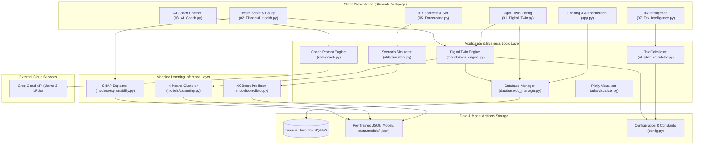
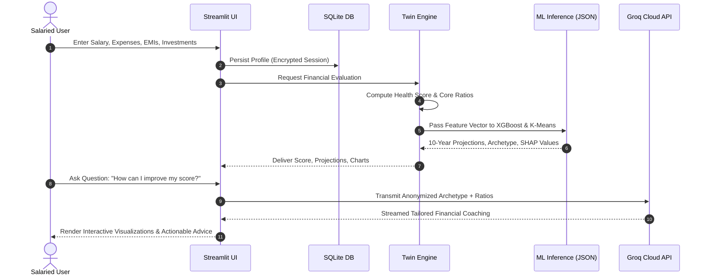
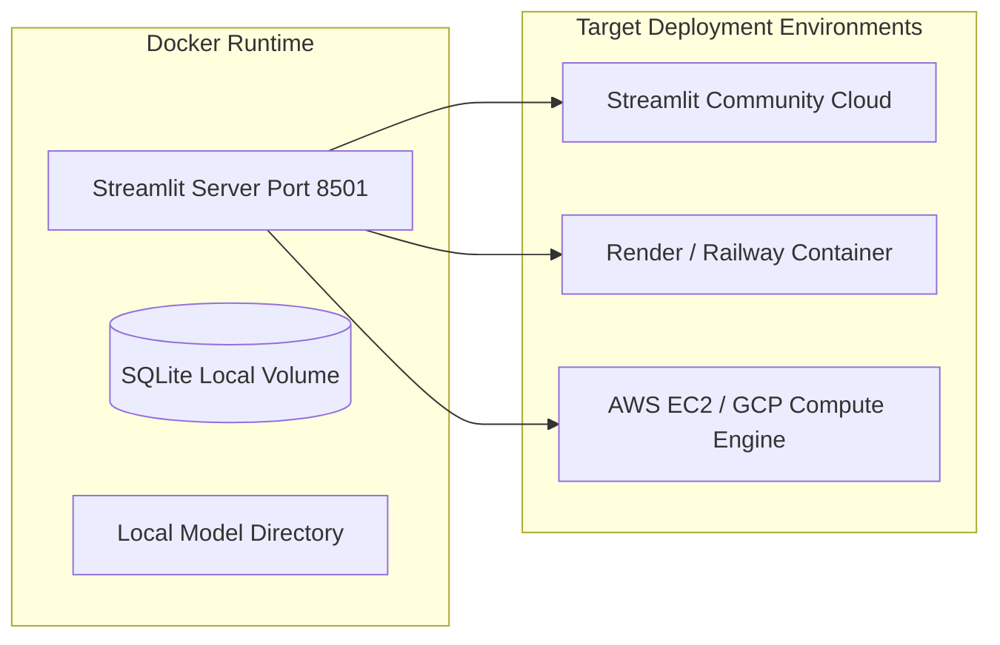

# System Architecture Document (SAD)
## Project Name: FinTwin AI
### Document Version: 1.0.0 | Status: Baseline Approved 

---

## 1. Architectural Overview & Design Philosophy

**FinTwin AI** is engineered as a decoupled, two-phase AI platform designed for high-speed responsiveness, mathematical explainability, and zero runtime dependency on raw training datasets. The core system architecture strictly isolates **Offline Machine Learning Training (Phase 1)** from the **Online Dashboard Runtime (Phase 2)**.

```
+-----------------------------------------------------------------------------------+
|                           PHASE 1: OFFLINE TRAINING                               |
|                                                                                   |
|  +-------------------+       +--------------------+       +--------------------+  |
|  | Synthetic Profile | ----> | Feature Pipeline   | ----> | Model Training     |  |
|  | Generator         |       | (StandardScaler,   |       | (XGBoost, K-Means, |  |
|  | (10,000 Profiles) |       |  Encoders)         |       |  TreeSHAP)         |  |
|  +-------------------+       +--------------------+       +---------+----------+  |
+---------------------------------------------------------------------|-------------+
                                                                      | Serializes to JSON
                                                                      v
+-----------------------------------------------------------------------------------+
|                         PHASE 2: LIVE RUNTIME DASHBOARD                           |
|                                                                                   |
|  +-------------------+       +--------------------+       +--------------------+  |
|  | User Input / Auth | ----> | Digital Twin       | ----> | Interactive Views  |  |
|  | (SQLite DB)       |       | Engine & Scoring   |       | (Plotly, Streamlit |  |
|  +-------------------+       +---------+----------+       |  Multipage)        |  |
|                                        |                  +--------------------+  |
|                                        v                                          |
|                              +--------------------+                               |
|                              | JSON Model Weights |                               |
|                              | & Groq LLM Coach   |                               |
|                              +--------------------+                               |
+-----------------------------------------------------------------------------------+
```

### Architectural Principles:
1. **Decoupled Training & Inference:** The live web dashboard loads only lightweight, versioned JSON model artifacts (`models/*.json`). Raw datasets never touch production runtime, guaranteeing fast cold-starts (<2 seconds) and zero database bloat.
2. **Zero-PII External Invocations:** External LLM calls (Groq API) are passed purely anonymized numerical ratios and categorical archetypes. Personally Identifiable Information (name, email, exact bank figures) never leaves the host server.
3. **Deterministic Core Calculations:** Core financial health formulas, debt ratios, and income tax calculations are purely deterministic and mathematically auditable, avoiding hallucination risks common to generative models.
4. **Transparent Explainability:** Model predictions are paired with SHAP (SHapley Additive exPlanations) values to provide auditable factor attributions for every output.

---

## 2. Technology Stack Selection

| Component Layer | Technology Chosen | Version | Selection Rationale |
|---|---|---|---|
| **Runtime Environment** | Python | 3.9 – 3.12 | Ubiquitous support for scientific computing, ML frameworks, and rapid rapid prototyping. |
| **Frontend & UI Engine** | Streamlit | 1.35+ | High developer velocity, native reactive session state, robust component ecosystem, and Python-native execution. |
| **Forecasting Engine** | XGBoost | 2.0+ | Superior performance on tabular financial data, fast JSON serialization, native support for non-linear interactions. |
| **Behavioral Clustering**| Scikit-Learn | 1.4+ | Proven K-Means implementation with deterministic centroid initialization and lightweight inference. |
| **Explainable AI (XAI)** | SHAP (TreeExplainer)| 0.44+ | Industry gold standard for local feature attribution in tree-based models with mathematical game-theory grounding. |
| **Database Layer** | SQLite 3 (WAL Mode)| 3.40+ | Serverless, zero-configuration, ACID-compliant, embeddable database ideal for localized storage and self-hosted deployments. |
| **Visualization Layer** | Plotly | 5.20+ | Hardware-accelerated, responsive, interactive SVG/WebGL charts (Gauges, Waterfalls, 3D Scatters, Radar). |
| **Conversational LLM** | Groq Cloud API | `llama-3-70b-versatile` | Sub-second Time-to-First-Token (TTFT) via LPU acceleration, enabling instantaneous conversational coaching. |
| **Testing & Quality** | Pytest | 8.0+ | Fast test runner with fixtures, assertions, and parameterized testing capabilities. |

---

## 3. High-Level System Architecture

The following diagram depicts the operational runtime interaction between components:



---

## 4. Subsystem & Component Specifications

### 4.1 Digital Twin Engine (`models/twin_engine.py`)
- **Responsibilities:**
  - Ingests profile primitives (salary, EMIs, expenses, savings, investments, debt).
  - Calculates core financial ratios: Savings Rate, Debt-to-Income (DTI), EMI Ratio, Emergency Runway in months.
  - Implements the 6-factor Financial Health algorithm returning a composite score $\in [0, 100]$ and grade assignment.
  - Generates standardized feature vectors for downstream machine learning inference.

### 4.2 Machine Learning Inference Modules (`models/`)
- **Predictor Module (`models/predictor.py`):**
  - Reads `forecast_model.json`.
  - Ingests current net worth, monthly contribution, increment expectation, and target horizon.
  - Computes recursive 10-year step projections with confidence intervals.
- **Clustering Module (`models/clustering.py`):**
  - Reads `cluster_model.json` and scaler parameters.
  - Projects user spending and investment ratios onto normalized 4D cluster spaces to classify archetype.
- **Explainability Module (`models/explainability.py`):**
  - Computes TreeSHAP feature contributions for the user's specific health score.
  - Identifies top 3 positive drivers and top 3 negative drags.

### 4.3 Tax Intelligence Engine (`utils/tax_calculator.py`)
- **Responsibilities:**
  - Evaluates tax brackets under both Old and New Tax Regimes (Section 115BAC).
  - Deductions applied: Standard Deduction, Section 80C, 80D, 24(b), 80CCD(1B), 87A rebate.
  - Produces an itemized comparative ledger showing gross income, deductions, taxable income, slab-wise tax, cess, and net savings.

### 4.4 AI Behavioral Coach (`utils/coach.py` & `utils/chatbot.py`)
- **Responsibilities:**
  - Aggregates the user's archetype, health score, and metric weaknesses.
  - Formulates a low-entropy, grounded system prompt.
  - Dispatches an asynchronous or streaming HTTPS request to the Groq Cloud endpoint.
  - Intercepts network latency and rate limits, seamlessly falling back to deterministic advice rules if needed.

---

## 5. Data Flow Architecture

The end-to-end data lifecycle follows a predictable, unidirectional pipeline:



---

## 6. Database & Storage Architecture

### 6.1 Database Engine
- **Engine:** SQLite 3 with Write-Ahead Logging (`PRAGMA journal_mode=WAL;`).
- **Concurrency:** Thread-safe connections utilizing connection pooling and row-level timeouts (`timeout=10.0`).
- **Data Integrity:** Strict foreign key enforcement (`PRAGMA foreign_keys = ON;`).

### 6.2 Data Security & Multi-Tenancy
- **Tenant Isolation:** Every table maintains a mandatory `user_id` foreign key. No query execution is permitted without an explicit parameter binding matching the authenticated user ID.
- **Credential Storage:** User passwords stored in `users.password_hash` are secured using PBKDF2 with SHA-256 and unique 16-byte random salts. Plaintext passwords never touch disk.

---

## 7. Security, Privacy, and Compliance

### 7.1 PII Protection in AI Invocations
To comply with Indian data protection standards (Digital Personal Data Protection Act - DPDPA 2023), the external LLM pipeline is strictly air-gapped from personal identifiers:
- **Included in LLM Context:** Financial Archetype name, Savings Rate percentage, EMI ratio, Emergency fund months, Health score integer.
- **Excluded from LLM Context:** Full Name, Email, Address, Exact Bank Account Balances, Employer Name, IP Address.

### 7.2 Secret Management
- Secrets (`GROQ_API_KEY`, session secrets) are loaded strictly via `os.environ` or `.env` using `python-dotenv`.
- Sample config files (`.env.example`) are provided with placeholder keys; production `.env` is locked via `.gitignore`.

---

## 8. Deployment & Scalability Strategy



### 8.1 Deployment Topology
- **Containerized Execution:** Self-contained Dockerfile utilizing `python:3.11-slim` with multi-stage build.
- **Stateless Web Layer:** The Streamlit application can be scaled horizontally behind an NGINX reverse proxy by configuring external PostgreSQL if SQLite needs expansion in future enterprise tiers.
- **Caching Layer:** Heavy operations (model loading, SHAP explainer initialization) use Streamlit’s native `@st.cache_resource` and `@st.cache_data` decorators to guarantee instant multi-page transitions.

### 8.2 Operational Telemetry & Monitoring
- **Application Logs:** Structured Python logging capturing timestamp, log level, module name, and execution duration.
- **Error Tracking:** Centralized exception trapping wrapping API calls and database connections.
- **Health Checks:** Endpoint `/healthz` returning HTTP 200 indicating SQLite accessibility and model artifact integrity.
