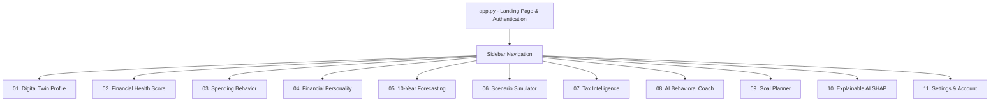

# UI/UX Specification Document
## Project Name: FinTwin AI
### Document Version: 1.0.0 | Status: Approved for Development 

---

## 1. Design Principles & Aesthetic Philosophy

**FinTwin AI** transforms personal finance from intimidating spreadsheets into an intuitive, empowering, and aesthetically captivating digital experience. The interface combines the elegance of modern fintech applications with the clarity of explainable AI data visualization.

### Core Principles
1. **Clarity Over Complexity:** Transform multi-dimensional financial ratios into visual hierarchies where key takeaways can be absorbed in under 5 seconds.
2. **Transparent, Explainable Math:** Every score, recommendation, and projection must offer an immediate breakdown of why it was generated; no opaque black boxes.
3. **Action-Oriented Feedback:** Never show a problem without a tangible next step (e.g., instead of just "High EMI Burden", display *"Refinance or pre-pay ₹5,000/mo to save ₹3.2L in interest"*).
4. **Delightful Micro-Interactions:** Provide smooth transitions, dynamic gauge animations, and real-time reactive recalculations when moving simulation sliders.
5. **Calm Financial Confidence:** Use clean typography, spacious layouts, and a sophisticated dark/light balance that relieves money-related anxiety.

---

## 2. Design System & Style Tokens

### 2.1 Color Palette

```
+--------------------------------------------------------------------------------+
|  Primary: Deep Slate      Secondary: Royal Blue      Accent: Emerald Green    |
|  #0F172A                  #1E3A8A                    #00A86B                  |
|  (Background & Structure) (Cards, Gradients, Brand)  (Growth, Success, Grade A)|
+--------------------------------------------------------------------------------+
|  Info: Cyan / Blue        Warning: Amber             Danger: Coral Red        |
|  #0284C7                  #F59E0B                    #EF4444                  |
|  (Metrics, Benchmarks)    (Grade C, Moderate Debt)   (Grade D, Deficit, Risk) |
+--------------------------------------------------------------------------------+
|  Neutral Surface          Text Main                  Text Muted               |
|  #1E293B / #FFFFFF        #F8FAFC / #0F172A          #94A3B8 / #64748B        |
+--------------------------------------------------------------------------------+
```

| Token Name | Hex Code | Purpose & Usage |
|---|---|---|
| `--color-bg-deep` | `#0F172A` | Primary dark theme background and navigation bar |
| `--color-brand-blue` | `#1E3A8A` | Primary brand accent, active tabs, header gradients |
| `--color-success-green` | `#00A86B` | Positive cashflow, Grade A score, wealth growth |
| `--color-warning-amber` | `#F59E0B` | Cautionary indicators, Grade C score, moderate EMI |
| `--color-danger-red` | `#EF4444` | High debt warning, negative cashflow, Grade D score |
| `--color-surface-card` | `#1E293B` | Elevation 1 container cards, dashboard widgets |
| `--color-text-primary` | `#F8FAFC` | High-contrast body typography, titles, values |
| `--color-text-muted` | `#94A3B8` | Subtitles, helper text, chart axis labels |

### 2.2 Typography Hierarchy
- **Primary Body Font:** `Inter` or `system-ui, -apple-system, BlinkMacSystemFont`
- **Headings & Brand Display:** `Outfit`, sans-serif
- **Data, Currency & Code:** `Fira Code` or `monospace`

| Style | Font Family | Size | Weight | Line Height | Usage |
|---|---|---|---|---|---|
| **Display H1** | Outfit | 32px | 700 (Bold) | 1.2 | Main Page Titles, Headline Score |
| **Section H2** | Outfit | 24px | 600 (Semi-Bold) | 1.3 | Module Containers, Major Subsections |
| **Card H3** | Inter | 18px | 600 (Semi-Bold) | 1.4 | Widget titles, Card Headers |
| **Body Standard**| Inter | 15px | 400 (Regular) | 1.5 | General descriptions, coaching tips |
| **Data Metric** | Fira Code | 22px | 700 (Bold) | 1.1 | Currency amounts (e.g. ₹18,50,000) |
| **Caption/Label**| Inter | 12px | 500 (Medium) | 1.4 | Benchmark tags, badges, chart legends |

### 2.3 Spacing & Elevation System
- **Grid Units:** 4px baseline system (`4px`, `8px`, `12px`, `16px`, `24px`, `32px`, `48px`).
- **Border Radius:**
  - Micro components (tags, badges): `4px`
  - Input fields, buttons: `8px`
  - Content cards & containers: `12px`
  - Modal dialogues: `16px`
- **Elevation Shadows:**
  - `card-shadow`: `0 4px 6px -1px rgba(0, 0, 0, 0.2), 0 2px 4px -2px rgba(0, 0, 0, 0.1)`
  - `glow-emerald`: `0 0 15px rgba(0, 168, 107, 0.35)`
  - `glow-blue`: `0 0 15px rgba(30, 58, 138, 0.45)`

---

## 3. Navigation & Information Architecture



### Navigation Anatomy
- **Left Sidebar:** Persistent across all internal pages. Features the FinTwin AI logo, authenticated user badge (`demo@fintwin.app`), health score quick-badge (`78/100 · Grade B`), page link list with icons, and a persistent Logout action.
- **Top Bar:** Page title, breadcrumb trail, and last profile update timestamp.
- **Content Canvas:** Center-aligned, maximum content width of 1200px, multi-column layout optimized for wide-screen monitors and tablets.

---

## 4. Detailed Screen Specifications

### Screen 00: Landing & Authentication (`app.py`)
- **Header:** Hero banner with gradient animation, dynamic typing subtitle, and clear value proposition.
- **Quick Demo Access:** Distinct "Try Instant Demo" button pre-populating credentials for effortless 1-click evaluation.
- **Login / Register Form:** Tabbed container with validation states for email format and password strength.
- **Value Highlights:** 3-column feature overview cards explaining Scoring, Tax Optimization, and Simulation.

### Screen 01: Digital Twin Profile (`pages/01_Digital_Twin.py`)
- **Structure:** 3 accordion groups:
  1. *Income & Core Expenses:* Monthly CTC, mandatory rent/groceries, discretionary spending.
  2. *Liabilities & Debts:* Total loan balances, monthly EMIs, credit card roll-overs.
  3. *Assets & Protections:* Liquid savings, monthly SIP, Term insurance cover, Health cover.
- **Real-Time Summary Card:** Right-hand sticky panel showing Net Monthly Cashflow = $\text{Income} - (\text{Expenses} + \text{EMIs} + \text{SIP})$. Green if positive, Red if deficit.

### Screen 02: Financial Health Score (`pages/02_Financial_Health.py`)
- **Hero Element:** Half-circle Plotly Gauge Chart displaying the 0–100 score, annotated with current Grade (`A`, `B`, `C`, `D`).
- **Metric Cards Grid:** 6 cards displaying the component metrics:
  - *Savings Rate* (% vs 30% benchmark)
  - *EMI Burden* (% vs 35% benchmark)
  - *Emergency Runway* (Months vs 6-month benchmark)
  - *SIP Rate* (% vs 15% benchmark)
  - *Insurance Coverage* (Adequate / Under-insured tag)
  - *Debt-to-Income* (Ratio vs 1.5x benchmark)
- **Status Indicators:** Micro-badges: `✓ Optimal`, `⚠ Needs Attention`, `✕ Critical Vulnerability`.

### Screen 05: 10-Year Forecasting (`pages/05_Forecasting.py`)
- **Visual Display:** Interactive Plotly line chart charting cumulative net worth over 10 consecutive years.
- **Projection Breakdown:** Toggleable stacked area chart distinguishing Liquid Reserves, Equity Mutual Funds, and Debt reduction.
- **Milestone Annotations:** Automatic markers indicating when net worth reaches ₹25 Lakhs, ₹50 Lakhs, and ₹1 Crore.

### Screen 06: Scenario Simulator (`pages/06_Scenario_Simulator.py`)
- **Interactive Control Deck:** Sliders with immediate debounce execution:
  - *Salary Increment:* Slider 0% to 25% (Default: 8%)
  - *New Monthly EMI:* Slider ₹0 to ₹1,00,000 (Default: ₹0)
  - *Market Return Expectation:* Slider 6% to 16% (Default: 12%)
  - *Inflation Rate:* Slider 4% to 10% (Default: 6%)
- **Comparative Chart:** Baseline Curve (Solid Blue) vs. Simulated Curve (Dashed Emerald).
- **Delta Summary Pill:** *"At Year 10, your net worth difference will be: +₹18,40,000"*.

### Screen 07: Tax Intelligence (`pages/07_Tax_Intelligence.py`)
- **Regime Toggle & Deduction Panel:** Side-by-side comparison tables.
- **Deductions Input:** Sliders/inputs for Section 80C, 80D, 24(b) home loan interest, and NPS 80CCD(1B).
- **Verdict Banner:** High-contrast callout container:
  - *"Recommendation: Switch to New Regime under Sec 115BAC to save ₹38,400 annually."*

### Screen 08: AI Behavioral Coach (`pages/08_AI_Coach.py`)
- **Chat Canvas:** Modern conversational interface with user speech bubbles (Right aligned, Slate) and FinTwin Coach responses (Left aligned, Royal Blue / Emerald border).
- **Context Badges:** Top banner showing: `Detected Persona: Disciplined Accumulator` | `Score: 78`.
- **Pre-Built Action Prompts:** Clickable prompt chips:
  - *"How do I eliminate my loan faster?"*
  - *"Can I afford a ₹15 Lakh car next year?"*
  - *"Where should I invest my tax refund?"*

### Screen 10: Explainable AI SHAP (`pages/10_Explainable_AI.py`)
- **Visualization:** SHAP Waterfall plot illustrating the base model score, positive contributions (green arrows), and negative deductions (red arrows).
- **Humanized Insights:** Plain English translation cards explaining the math behind the machine learning outputs.

---

## 5. UI Component Library & State Patterns

```
+-----------------------------------------------------------------------------------+
| COMPONENT STATES                                                                  |
|                                                                                   |
| 1. Normal State:    [ Complete Profile Button ]                                   |
| 2. Hover State:     [ Complete Profile Button (Elevated + Glow) ]                 |
| 3. Loading State:   [ Spinning Indicator + "Simulating 10-Year Projections..." ] |
| 4. Empty State:     [ Illustration: No Goals Defined Yet + "Create First Goal" ]  |
| 5. Error State:     [ Alert: "Expenses exceed income by ₹12,000. Recheck inputs" ]|
+-----------------------------------------------------------------------------------+
```

### Reusable UI Components
1. **Metric Stat Card:**
   - Label (Uppercase, 11px, muted)
   - Value (Bold, 22px, monospace Fira Code)
   - Delta badge (Green pill `+12%`, Red pill `-4%`)
2. **Health Gauge Widget:**
   - 180-degree radial Plotly gauge with color stops (Red 0-40, Yellow 40-60, Blue 60-80, Green 80-100).
3. **Regime Comparison Table:**
   - Alternating row zebra striping, bold totals row, highlighted difference column.
4. **Chat Message Bubble:**
   - Markdown formatting support, code blocks for math calculations, instant copy-to-clipboard button.

---

## 6. Responsive Behavior & Viewport Breakpoints

| Breakpoint | Target Devices | Layout Adaptations |
|---|---|---|
| **Desktop (> 1024px)** | Laptops, Desktop Monitors | Full sidebar open by default; 2-column and 3-column metric grids; full-width interactive charts. |
| **Tablet (768px – 1023px)** | iPads, Surface tablets | Collapsible sidebar; 2-column metrics; charts resize dynamically via Plotly `responsive=True`. |
| **Mobile (< 767px)** | Smartphones | Sidebar toggles into slide-over hamburger drawer; metric grids stack into a single column; sliders expand to full width. |

---

## 7. Accessibility (a11y) & Standards Compliance
- **WCAG 2.1 AA Compliance:** Minimum color contrast ratio of 4.5:1 for all standard body text and 3:1 for large display headers and icons.
- **Colorblind-Safe Palettes:** Crucial status indicators pair color coding with textual icons (e.g. `✓ Safe`, `⚠ Warning`, `✕ Danger`) so information is not conveyed by color alone.
- **Keyboard Navigation:** Form inputs and interactive sliders support standard `Tab`, `Shift+Tab`, and Arrow Key navigation.
- **Screen Reader Labels:** Form inputs specify explicit labels (`aria-label` equivalent in Streamlit inputs).
