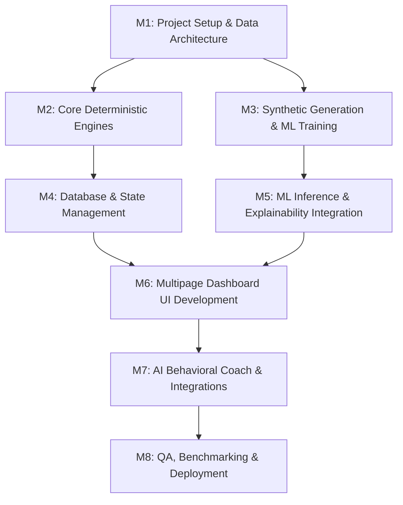

# Development Plan & Engineering Roadmap
## Project Name: FinTwin AI
### Document Version: 1.0.0 | Status: Approved for Execution 

---

## 1. Project Management Framework & Strategy

The development of **FinTwin AI** follows an iterative, milestone-driven engineering approach. The project is structured across **8 sequential milestones** designed to achieve a production-ready, test-validated Minimum Viable Product (MVP) followed by production deployment and scaling.

### Core Development Principles
1. **Offline-First ML Architecture:** Complete synthetic data generation, feature engineering, and model training in Phase 1 before building runtime components that consume the JSON artifacts.
2. **Deterministic Validation First:** Implement and test mathematical rules (Health Score, Old vs. New Tax Engine) before connecting machine learning models.
3. **Continuous Test-Driven Validation:** Maintain a dedicated `tests/` suite ensuring zero regressions across scoring, taxation, simulation, and conversational boundaries.
4. **Zero-PII Compliance by Design:** Ensure data privacy boundaries are implemented at the schema and API client layers from Day 1.

---

## 2. Priority Hierarchy & Dependency Matrix

### 2.1 Priority Classification
- **P0 (Critical / Blocker):** Core functionality required for MVP operation (Profile database, 0–100 Health Score, Tax Calculator, Offline ML models, Streamlit navigation).
- **P1 (High Priority):** Features providing key competitive value (SHAP Explainability, 10-Year What-If Simulation, Groq LLM Coaching, Goal Planner).
- **P2 (Medium / Nice-to-Have):** Enhancements, custom themes, email export reports, and advanced sensitivity toggles.

### 2.2 Milestone Dependency Graph

---

## 3. Milestones & Task Breakdown

### Milestone 1: Environment Setup & Data Foundation
- **Target Timeline:** Sprint 1 (Days 1–3)
- **Priority:** P0 (Critical)
- **Deliverables:**
  1. Repository initialization with clean virtual environment (`python -m venv venv`).
  2. Dependency specification in `requirements.txt` (Streamlit, XGBoost, Scikit-Learn, SHAP, Plotly, Groq, Pytest).
  3. Environment configuration template (`.env.example` & `.env`).
  4. Global application constants and tax brackets defined in `config.py`.
  5. SQLite schema definition in `database/schema.sql` with user and profile tables.

### Milestone 2: Core Deterministic Financial Engines
- **Target Timeline:** Sprint 1 (Days 4–7)
- **Priority:** P0 (Critical)
- **Deliverables:**
  1. **Digital Twin Engine (`models/twin_engine.py`):**
     - Class `DigitalTwin` implementing 6-factor health scoring algorithm.
     - Grade calculation logic (`A`, `B`, `C`, `D`).
     - Derived metrics: Savings rate, debt-to-income, emergency runway.
  2. **Indian Tax Engine (`utils/tax_calculator.py`):**
     - Slabs computation for Old Regime with Sections 80C, 80D, 24(b), and standard deduction.
     - Slabs computation for New Regime under Section 115BAC with updated standard deduction and Section 87A rebate.
     - Optimal regime recommendation logic.

### Milestone 3: Machine Learning & Offline Training Pipeline
- **Target Timeline:** Sprint 2 (Days 8–12)
- **Priority:** P0 (Critical)
- **Deliverables:**
  1. **Synthetic Profile Generator (`data/generator.py`):**
     - Generate 10,000 realistic synthetic Indian salaried profiles based on census and salary distribution parameters.
  2. **Feature Engineering Pipeline (`data/preprocessor.py`):**
     - Normalize inputs, handle outliers, and create training feature matrices.
  3. **Offline Training Script (`training/train_offline.py`):**
     - Train XGBoost 10-year savings and wealth regression model.
     - Train K-Means clustering model for spending personality classification (4 clusters).
     - Fit TreeSHAP explainer for health score factor attribution.
     - Serialize trained models as clean JSON artifacts to `data/models/`.

### Milestone 4: Database Layer & Session Security
- **Target Timeline:** Sprint 2 (Days 13–15)
- **Priority:** P0 (Critical)
- **Deliverables:**
  1. **Database Manager (`database/db_manager.py`):**
     - Implement thread-safe CRUD methods for user authentication, profile updates, and goal records.
     - Implement PBKDF2/SHA-256 password hashing with individual salt generation.
     - Pre-seed standard demo account (`demo@fintwin.app` / `Demo@123`).
  2. **Session Security & Isolation:**
     - Enforce `st.session_state` checks across all internal pages to prevent unauthenticated access.

### Milestone 5: Frontend Development & Multipage Dashboard
- **Target Timeline:** Sprint 3 (Days 16–21)
- **Priority:** P0 / P1
- **Deliverables:**
  1. **Landing & Authentication (`app.py`):** Hero section, 1-click demo login, login/registration forms.
  2. **Digital Twin Builder (`pages/01_Digital_Twin.py`):** Accordion form for income, debts, investments, and insurance.
  3. **Financial Health Dashboard (`pages/02_Financial_Health.py`):** Half-circle radial score gauge and 6 benchmark metric tiles.
  4. **Spending Behavior & Cohorts (`pages/03_Behavior_Analysis.py` & `04_Financial_Personality.py`):** Peer radar charts and archetype badge.
  5. **10-Year Forecast & Simulator (`pages/05_Forecasting.py` & `06_Scenario_Simulator.py`):** Plotly multi-year line curves and interactive slider deck.
  6. **Tax Intelligence (`pages/07_Tax_Intelligence.py`):** Side-by-side Old vs. New comparison table with deduction inputs.
  7. **Goal Planner (`pages/09_Goal_Planner.py`):** Goal creation, compound target calculators, and feasibility status pills.
  8. **Explainable AI (`pages/10_Explainable_AI.py`):** SHAP Waterfall visualization and natural-language drivers.
  9. **Account Settings (`pages/11_Settings.py`):** Profile resets, password updates, and data export.

### Milestone 6: AI Behavioral Coach Integration
- **Target Timeline:** Sprint 3 (Days 22–24)
- **Priority:** P1 (High)
- **Deliverables:**
  1. **Coach Logic (`utils/coach.py` & `utils/chatbot.py`):**
     - Integration with Groq Cloud API (`llama-3-70b-versatile` / `llama3-8b-8192`).
     - Prompt engineering enforcing 150-word max length, Indian financial context, and zero-PII transmission.
     - Deterministic rule-based fallback generator triggered upon API timeout or network disconnection.
  2. **Interactive Chat Interface (`pages/08_AI_Coach.py`):**
     - Streamlit chat messaging container with quick action chips.

### Milestone 7: Testing, Edge Case Hardening & Quality Assurance
- **Target Timeline:** Sprint 4 (Days 25–28)
- **Priority:** P0 (Critical)
- **Deliverables:**
  1. Unit tests for health score calculations (`tests/test_twin_engine.py`).
  2. Tax engine edge cases (Zero income, high HRA, maximum deductions).
  3. Chatbot length and fallback tests (`tests/test_chatbot_length.py`).
  4. Division-by-zero validation tests across all ratio calculations.
  5. Latency benchmarking ensuring sub-400ms inference times.

### Milestone 8: Packaging, Documentation & Deployment
- **Target Timeline:** Sprint 4 (Days 29–30)
- **Priority:** P1 (High)
- **Deliverables:**
  1. Comprehensive project documentation in `document/` folder.
  2. Streamlit Cloud / Docker containerization configuration (`Dockerfile`, `.dockerignore`).
  3. Final verification of demo workflow and production handover.

---

## 4. Definition of Done (DoD)

### 4.1 DoD for User Stories & Features
A feature or user story is considered **Done** only when:
- [x] Code is written in compliance with project style guides and type annotations.
- [x] All user inputs are validated against boundary constraints (no negative numbers, no unhandled nulls).
- [x] Unit and integration tests are written and passing with 100% assertion success.
- [x] UI components render responsively across Desktop (1080p), Tablet, and Mobile viewports.
- [x] Zero unhandled exceptions or stack traces appear in the Streamlit UI.

### 4.2 DoD for Machine Learning Pipeline
An ML model or data pipeline is considered **Done** only when:
- [x] Synthetic dataset generation reproduces deterministic distributions across salary brackets.
- [x] Trained models are validated for $R^2 \ge 0.85$ (Forecasting) and distinct cluster separation (K-Means).
- [x] Model weights are serialized cleanly in JSON without binary pickle dependencies.
- [x] SHAP values explain 100% of variance between base value and individual output score.
- [x] Inference execution completes in $<400\text{ms}$ on standard CPU hardware.

### 4.3 DoD for Production MVP Release
The FinTwin AI system is ready for release when:
- [x] Pre-seeded demo account (`demo@fintwin.app` / `Demo@123`) loads instantaneously.
- [x] All 11 navigation pages render without latency spikes or errors.
- [x] Groq API integration succeeds, with graceful fallback verified under network disconnection.
- [x] Complete documentation suite (PRD, SRS, Architecture, UI/UX, Development Plan) is approved.
- [x] Entire `pytest` test suite passes cleanly with zero failures.

---

## 5. Risk Management & Contingency Plan

| Risk Factor | Probability | Impact | Mitigation Plan |
|---|---|---|---|
| **Groq Cloud API Rate Limits** | Medium | Medium | Implemented local heuristics coach in `utils/coach.py` that serves immediate rule-based recommendations if Groq returns HTTP 429/500. |
| **Streamlit Session State Loss** | Low | Medium | Critical user state is persisted directly to SQLite on every form submission; session restores automatically upon reload. |
| **Tax Law Amendments in Union Budget** | High | Low | Decoupled all tax brackets and standard deduction variables into `config.py`, allowing updates in under 5 minutes without touching engine code. |
| **Model Deserialization Failure** | Low | High | Added explicit fallback checks at cold start: if `data/models/*.json` is missing, user-friendly prompt instructs administrator to run `training/train_offline.py`. |
